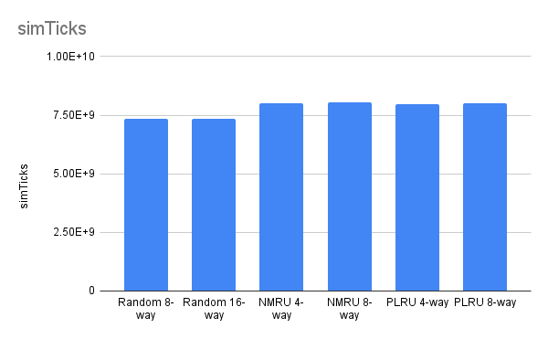
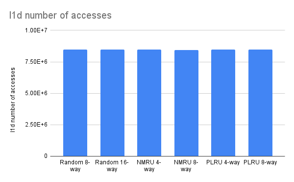
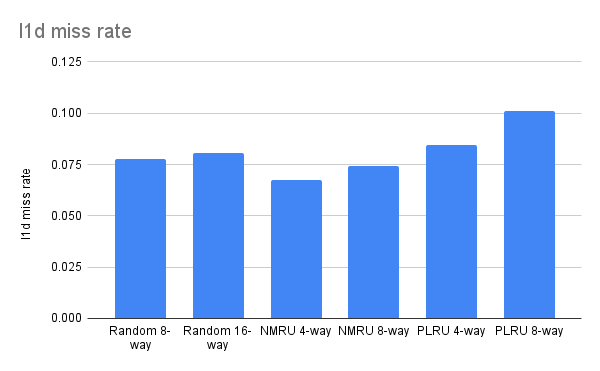
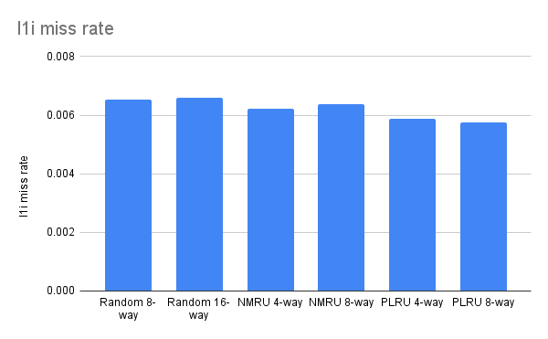

The goal is to analyze the cache miss rate for a blocked (IKJ) matrix multiplication program under changing associativity and replacement policies (PLRU, NMRU, and Random)

Cache configuration -> caches.py
gem5 configuration for simulation -> two-level.py

The following table summarizes the data collected from the blocked matrix multiply kernel (128x128) using an O3CPU model.

| Metric | Run 1: Random 8-way | Run 2: Random 16-way | Run 3: NMRU 4-way | Run 4: NMRU 8-way | Run 5: PLRU 4-way | Run 6: PLRU 8-way |
| :--- | :--- | :--- | :--- | :--- | :--- | :--- |
| **simTicks** | 7330203270 | 7330716135 | 7992174090 | 8061140295 | 7950873885 | 8016618045 |
| **L1D Accesses** | 8462274 | 8461316 | 8458417 | 8450999 | 8465747 | 8463306 |
| **L1D Miss Rate** | 0.077729 | 0.080587 | 0.067665 | 0.074098 | 0.084535 | 0.100923 |
| **L1I Accesses** | 601530 | 601355 | 590260 | 590404 | 590121 | 590404 |
| **L1I Miss Rate** | 0.006517 | 0.006598 | 0.006213 | 0.006374 | 0.005887 | 0.005752 |

